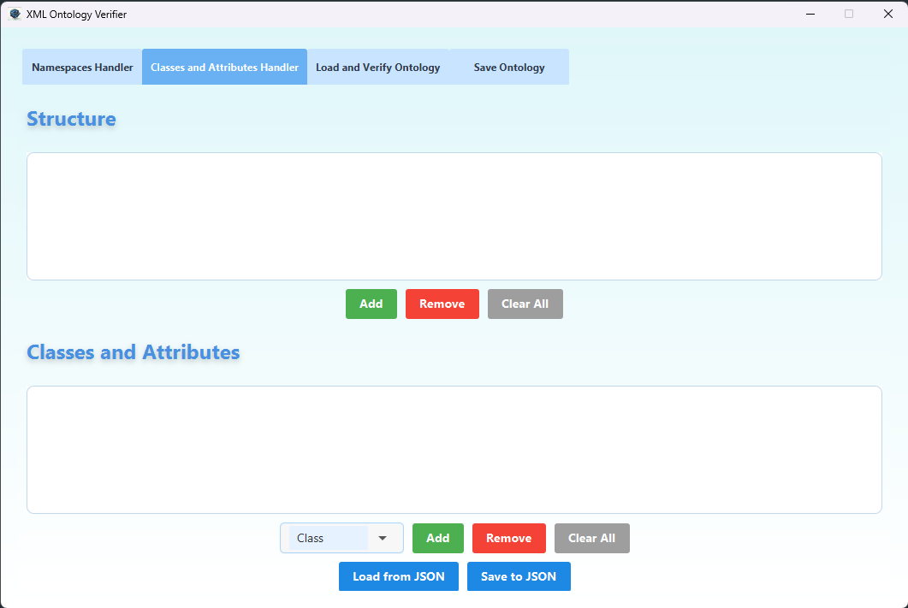
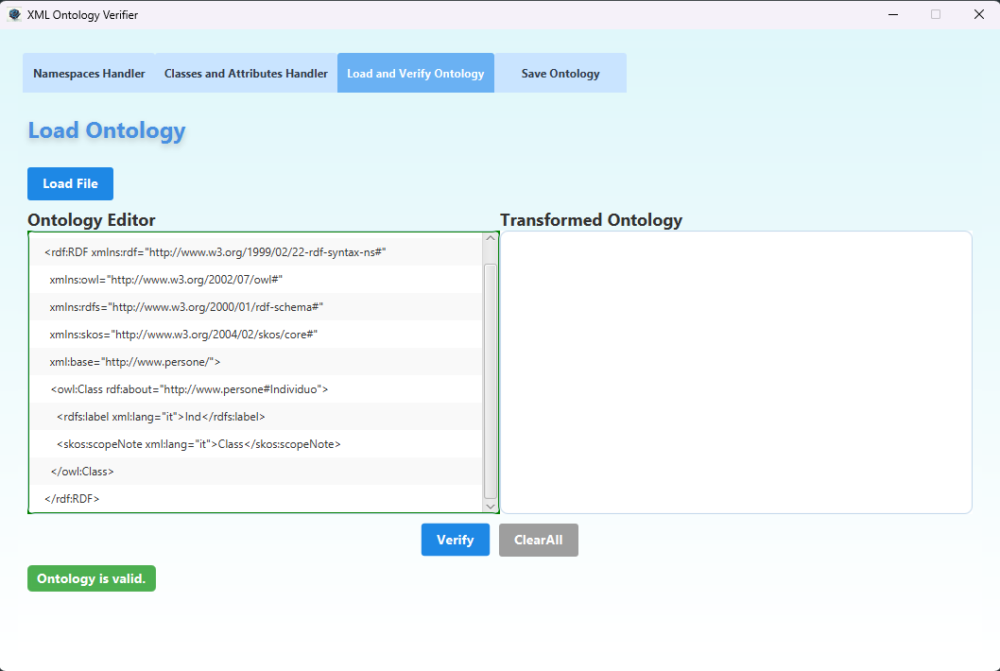

# Ontology Validator and Editor with CDuce and Java

A tool for automatic validation, transformation, and management of ontologies expressed in XML/OWL, developed as part of the Bachelor's thesis in Computer Science at the University of Turin.

## 📘 Description

This project integrates **Java** and **CDuce** to create a comprehensive ecosystem dedicated to the manipulation of XML-based ontologies. It includes:

- ✅ Automated structural consistency verification of ontologies  
- 🛠 Assisted correction and transformation of OWL structures  
- 🧩 JavaFX graphical user interface for user interaction  
- 🔌 Java wrapper to execute and control CDuce code  
- 🧪 Analysis of differences (diff) between ontology versions  

## 📂 Project Structure

```
/src
├── gui/ # Controllers and user interface (JavaFX)
/logic
│ ├── cducecompiler/ # Creates and operates CDuce commands via command line
│ ├── data/ # Definitions of custom data structures (Ontology, ErrorInfo, etc.)
│ ├── shellinterface/ # Executes shell commands in WSL environment
│ ├── utilities/ # Utility classes and helper functions
│ └── xml/ # XML utilities: diff checker, validation, etc.
├── logs/ # Logging system
├── main/ # Main application entry point
├── middleware/ # Middleware singleton managing Java-CDuce communication
/resources
/templates/ # CDuce templates with dynamic placeholders
/ontologies/ # Sample ontologies for testing
```

## 🔧 Requirements

- **Java 17+**  
- **CDuce** (compiler installed and accessible via shell)  
- **JavaFX SDK**  
- **Maven** or **Gradle** for automated builds  

## 🧠 Main Features

- Structural XML validation via CDuce and custom XPath queries  
- Semantic transformation of thesauri into OWL ontologies  
- Error highlighting with correction suggestions  
- User-friendly interface supporting namespaces, editor, and hierarchical view  
- Diff system between two ontology versions with node-level analysis  

## 📸 Screenshot (GUI)








## 📖 Reference Thesis

Lorenzo Pasini, *Strumenti formali e user-friendly per la manipolazione di strutture ontologiche*  
University of Turin, Academic Year 2024/2025  
Advisor: Prof. Viviana Bono  
Co-advisor: Dr. Davide Camino  

## 📜 License

This project is distributed under the MIT License.
